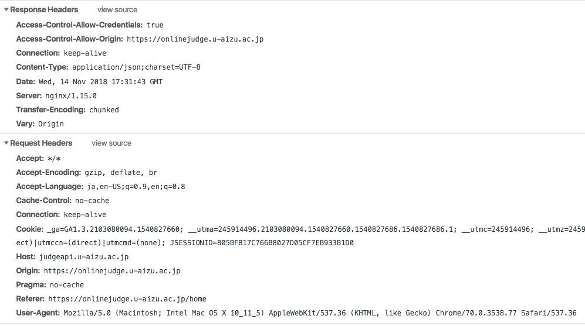

# HTTP ヘッダー

### HTTP ヘッダーとは

クライアントやサーバーがリクエストやレスポンスで追加情報を渡すための仕組みです。
以下のように構成されています。

```
  ヘッダー名:値(改行なし)
```

ヘッダー名は大文字、小文字を区別しません。

以下の画像のはその一例です(Aizu Online Juduge)



 上記画像で `Response Headers` と `Request Headers` に分かれている通りいくつかの分類があります。

- General header
  - リクエスト、レスポンスの両方に適用されるが、最終的に本文で転送されるデータとは関係がない
- Request header
  - 読み込むリソースやクライアント自身に関する情報を持つ
- Response heade
  - レスポンスに関する情報やサーバー自身に関する情報を持つ
- Entity header
  - コンテンツの長さ、 MIME タイプなどエンティティの情報を持つ

例えばログインのための認証  やセッション管理などには

- Authorization
- Cookie
- Set-Cookie
  などが使われたりします。

### 参考資料

- [MDN web docs](https://developer.mozilla.org/ja/docs/Web/HTTP/Headers)
